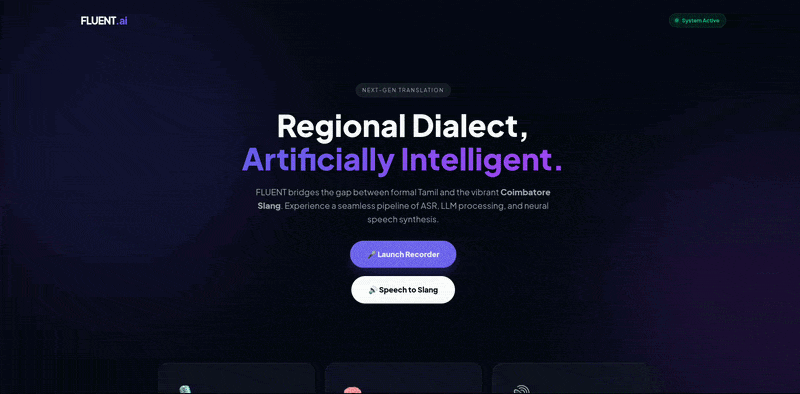

# 🎙️ FLUENT AI — Speak Tamil. Sound Local.



> *An end-to-end speech intelligence system that transforms formal Tamil into authentic Coimbatore (Kongu) slang — and speaks it back to you.*

---

## 🧠 What is FLUENT AI?

Ever noticed how Tamil spoken in Coimbatore has its own vibe? The slang, the rhythm, the way a sentence just *hits* differently when it's in Kongu dialect? That's exactly what FLUENT AI is built around.

FLUENT AI is a full speech-to-speech pipeline that:
1. **Listens** to you speak Tamil
2. **Understands** the tone and emotion behind your words
3. **Converts** your formal Tamil into natural Coimbatore (Kongu) slang
4. **Speaks it back** to you in a realistic human voice

No more stiff, textbook Tamil. FLUENT AI talks the way people actually talk — in Coimbatore.

---

## 🔁 How It Works

```
🎤 You Speak  →  ASR (Tamil Text)  →  Tone & Emotion Analysis
                                              ↓
                              Slang Conversion (Groq LLM + RAG)
                                              ↓
                         🔊 Sarvam AI TTS (Bulbul v3) → Natural Speech Output
```

### Step-by-Step Pipeline

| Stage | What Happens |
|-------|-------------|
| 🎙️ **Speech Input** | User speaks into a microphone via the web interface |
| 📝 **ASR** | Spoken Tamil is transcribed into text using an Automatic Speech Recognition model |
| 💬 **Tone & Emotion Analysis** | The system reads the context — is it casual? emotional? sarcastic? |
| 🔄 **Slang Conversion** | Groq LLM (with optional RAG retrieval) rewrites the text into Kongu-style slang |
| 🔊 **TTS Output** | Sarvam AI's Bulbul v3 model converts the slang text into natural-sounding Tamil speech |

---

## ✨ Features

- 🗣️ **Real-time speech-to-speech** — Speak and get a response instantly
- 🌍 **Regional dialect adaptation** — Authentic Coimbatore Kongu slang, not generic Tamil
- 🧠 **Context-aware conversion** — Tone and emotion are factored into slang generation
- 📚 **RAG-powered retrieval** — Optional slang knowledge base for more accurate dialect mapping
- 🔊 **Human-like voice output** — Powered by Sarvam AI's Bulbul v3 TTS model
- 🌐 **Web-based interface** — Clean browser UI with mic input and audio playback
- 🧱 **Modular architecture** — ASR, NLP, LLM, and TTS are fully independent components

---

## 🛠️ Tech Stack

| Component | Technology |
|-----------|-----------|
| **Web Framework** | Flask (Python) |
| **ASR** | Automatic Speech Recognition model (Tamil) |
| **LLM** | Groq LLM |
| **Retrieval (RAG)** | Vector-based retrieval for slang knowledge |
| **TTS** | Sarvam AI — Bulbul v3 |
| **Frontend** | HTML/CSS/JS with microphone and audio playback support |

---

## 🚀 Getting Started

### Prerequisites

Make sure you have the following installed:
- Python 3.9+
- pip
- A working microphone
- API keys for **Groq** and **Sarvam AI**

### Installation

```bash
# Clone the repository
git clone https://github.com/Gugan-23/Generative-AI-Fluent-AI.git
cd Generative-AI-Fluent-AI

# Create a virtual environment
python -m venv venv
source venv/bin/activate  # On Windows: venv\Scripts\activate

# Install dependencies
pip install -r requirements.txt
```

### Environment Variables

Create a `.env` file in the root directory and add your API keys:

```env
GROQ_API_KEY=your_groq_api_key_here
SARVAM_API_KEY=your_sarvam_api_key_here
```

### Run the App

```bash
python app.py
```

Then open your browser and visit:
```
http://localhost:5000
```

Click the mic button, speak in Tamil, and let FLUENT AI do the rest. 🎧

---

## 📁 Project Structure

```
Generative-AI-Fluent-AI/
│
├── app.py                  # Flask app entry point
├── asr/                    # Automatic Speech Recognition module
├── nlp/                    # Tone & emotion analysis
├── slang/                  # Slang conversion engine (LLM + RAG)
├── tts/                    # Text-to-Speech module (Sarvam AI)
├── static/                 # Frontend assets (CSS, JS)
├── templates/              # HTML templates
├── requirements.txt        # Python dependencies
└── .env.example            # Environment variable template
```

---

## 🎯 Why FLUENT AI?

Most AI systems treat language as monolithic — one standard form, one correct way to say things. But language is alive. It shifts by region, community, and culture.

Coimbatore Tamil isn't broken standard Tamil — it's its own expressive, vibrant dialect. FLUENT AI was built to **celebrate that**, not flatten it.

This project shows that modern generative AI can be used not just for efficiency — but for **cultural authenticity**.

---

## 🤝 Contributing

Got ideas to improve dialect accuracy? Want to add support for more regional Tamil slangs? Contributions are welcome!

```bash
# Fork the repo, create your branch
git checkout -b feature/your-feature-name

# Make your changes and commit
git commit -m "Add: your feature description"

# Push and open a Pull Request
git push origin feature/your-feature-name
```

---

## 📄 License

This project is licensed under the MIT License. See the [LICENSE](LICENSE) file for details.

---

## 🙌 Acknowledgements

- [Groq](https://groq.com/) — For blazing-fast LLM inference
- [Sarvam AI](https://sarvam.ai/) — For the Bulbul v3 Tamil TTS model
- The Coimbatore Tamil community — For keeping the dialect alive and vibrant 🫶

---

<div align="center">
  <i>Built with ❤️ for regional language AI — because every dialect deserves a voice.</i>
</div>
